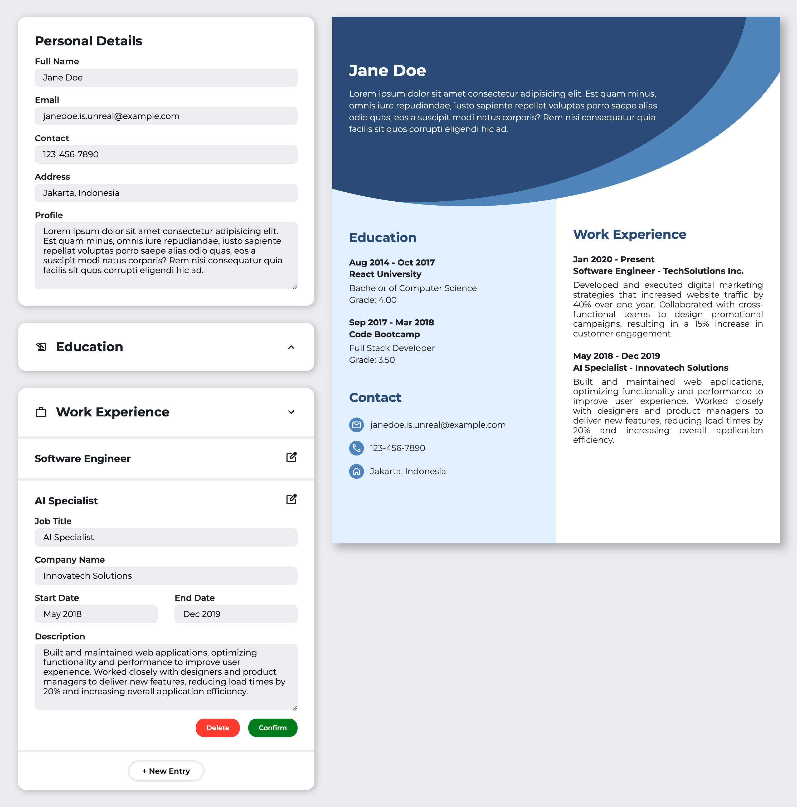

# Resume Builder

This project is part of **The Odin Project's** React course of the Full Stack JavaScript path. Completing this project demonstrates an understanding and proficiency in using React to create a *Resume Builder* website which lets user input a set of data and generates a resume based on that information. This project requires an understanding of the following React concepts:

- *Components* for creating reusable components of a web-page;
- *Passing data* between components
- *Rendering & State* to make the components dynamic

## Project Result

## Attribution

- Every icon used in this project was obtained from [Google Fonts](https://fonts.google.com/icons)