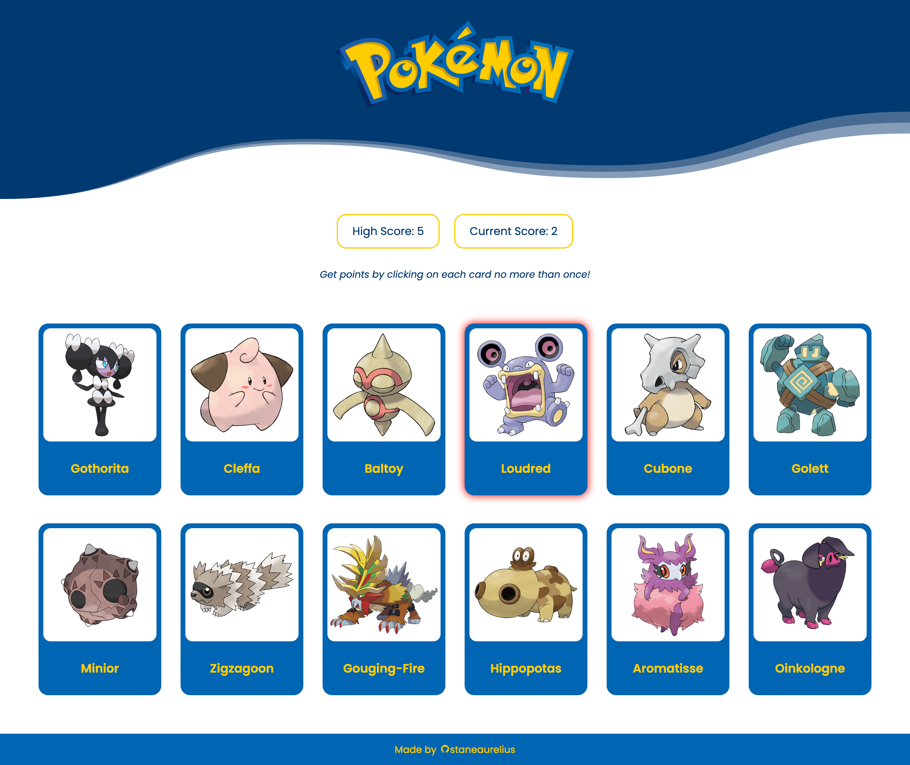

# Memory Card

This project is part of **The Odin Project's** React course of the Full Stack JavaScript path. Completing this project demonstrates an understanding and proficiency in using React to create a *Memory Card* website game which . This project requires an understanding of the following React concepts:

- *Components* for creating reusable components of a web-page,
- *Rendering, State, and Data Share* to enable dynamic components,
- *Side Effect* to synchronize components with external API.

## Project Result

## Attribution

- Every Pokémon data used in this project was fetched from [PokéApi](https://pokeapi.co/)
- Logo used in the header: [International Pokemon Logo](https://press.pokemon.com/en/Pokemon-Logo-55300)